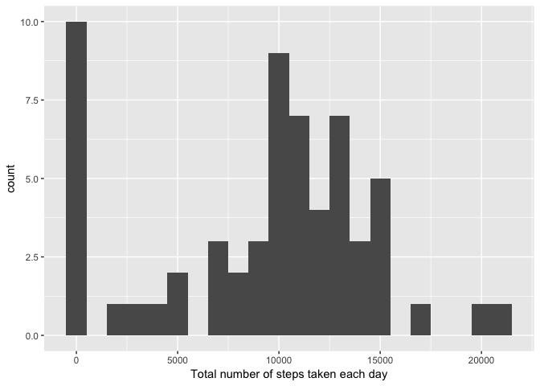
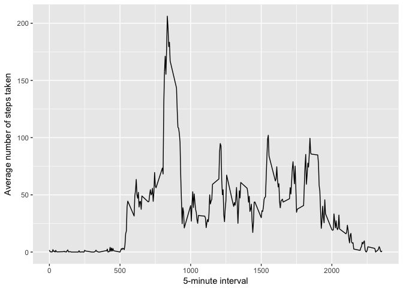
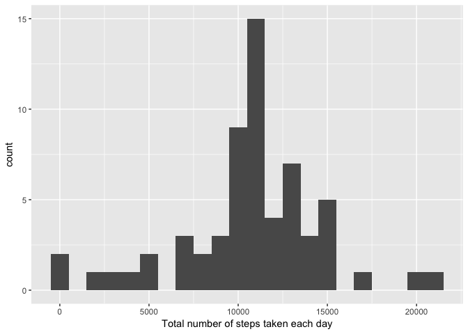
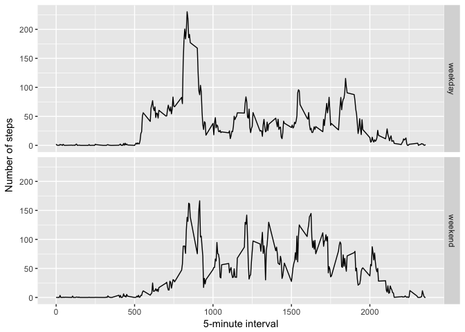

## Loading packages

```r
library(ggplot2)
```

## Loading and preprocessing the data

```r
if(!file.exists("activity.csv")){
    unzip("activity.zip")
}

data <- read.csv("activity.csv")
```

## What is mean total number of steps taken per day?

```r
total.steps <- tapply(data$steps, data$date, FUN = sum, na.rm = TRUE)
```

### 1. Make a histogram of the total number of steps taken each day

```r
qplot(total.steps, binwidth = 1000, xlab = "Total number of steps taken each day")
```

<!-- -->

### 2. Calculate and report the mean and median total number of steps taken per day

```r
  stepsByDayMean <- mean(total.steps, na.rm = TRUE)
stepsByDayMedian <- median(total.steps, na.rm = TRUE)
print(c("Mean:",   round(stepsByDayMean,   digits = 0))) 
```

```
## [1] "Mean:" "9354"
```

```r
print(c("Median:", round(stepsByDayMedian, digits = 0))) 
```

```
## [1] "Median:" "10395"
```

## What is the average daily activity pattern?

```r
averages <- aggregate(x = list(steps = data$steps), 
                      by = list(interval = data$interval), 
                      FUN = mean, na.rm = TRUE)
```

### 1. Make a time series plot

```r
ggplot(data = averages, 
        aes(x = interval, y = steps)) +
        geom_line() +
        xlab("5-minute interval") +
        ylab("Average number of steps taken") 
```

<!-- -->

### 2. Which 5-minute interval, on average across all the days in the dataset, contains the maximum number of steps?

```r
mostSteps <- which.max(averages$steps)

print(paste("The interval with the highest avg steps is", averages[mostSteps, ]$interval, "and the # of steps for that interval is", round(averages[mostSteps, ]$steps, digits = 1)))
```

```
## [1] "The interval with the highest avg steps is 835 and the # of steps for that interval is 206.2"
```

## Imputing missing values
### 1. Calculate and report the total number of missing values in the dataset

```r
numMissingValues <- length(which(is.na(data$steps)))
print(c("Number of missing values: ", numMissingValues)) 
```

```
## [1] "Number of missing values: " "2304"
```

### 2. Devise a strategy for filling in all of the missing values in the dataset.
#### All of the missing values are filled in with mean value for that 5-minute interval.

```r
# Replace each missing value with the mean value of its 5-minute interval
fill.value <- function(steps, interval) {
    filled <- NA
    if (!is.na(steps)) 
        filled <- c(steps) else filled <- (averages[averages$interval == interval, "steps"])
    return(filled)
}
```

### 3. Create a new dataset that is equal to the original dataset but with the missing data filled in.

```r
filled.data <- data
filled.data$steps <- mapply(fill.value, filled.data$steps, filled.data$interval)
```

### 4. Make a histogram of the total number of steps taken each day

```r
total.steps <- tapply(filled.data$steps, filled.data$date, FUN = sum)
qplot(total.steps, binwidth = 1000, xlab = "Total number of steps taken each day")
```

<!-- -->

```r
  stepsByDayMean_2 <- mean(total.steps)
stepsByDayMedian_2 <- median(total.steps)
print(c("Mean:",   round(stepsByDayMean_2,   digits = 0))) 
```

```
## [1] "Mean:" "10766"
```

```r
print(c("Median:", round(stepsByDayMedian_2, digits = 0))) 
```

```
## [1] "Median:" "10766"
```

```r
# Mean and median values are higher after imputing missing data. The reason is that in the original data, there are some days with steps values NA for any interval. The total number of steps taken in such days are set to 0s by default. However, after replacing missing steps values with the mean steps of associated interval value, these 0 values are removed from the histogram of total number of steps taken each day.
```

## Are there differences in activity patterns between weekdays and weekends?

### 1. Create a new factor variable in the dataset with two levels – “weekday” and “weekend” indicating whether a given date is a weekday or weekend day.

```r
weekday.or.weekend <- function(date) {
    day <- weekdays(date)
    if (day %in% c("Monday", "Tuesday", "Wednesday", "Thursday", "Friday")) 
        return("weekday") else if (day %in% c("Saturday", "Sunday")) 
        return("weekend") else stop("invalid date")
}
filled.data$date <- as.Date(filled.data$date)
 filled.data$day <-  sapply(filled.data$date, FUN = weekday.or.weekend)
```

### 2. Make a panel plot containing a time series plot (i.e. 𝚝𝚢𝚙𝚎 = "𝚕") of the 5-minute interval (x-axis) and the average number of steps taken, averaged across all weekday days or weekend days (y-axis). 

```r
averages <- aggregate(steps ~ interval + day, data = filled.data, mean)
ggplot(averages, aes(interval, steps)) + 
        geom_line() + 
        facet_grid(day ~ .) + 
        xlab("5-minute interval") + 
        ylab("Number of steps")
```

<!-- -->
